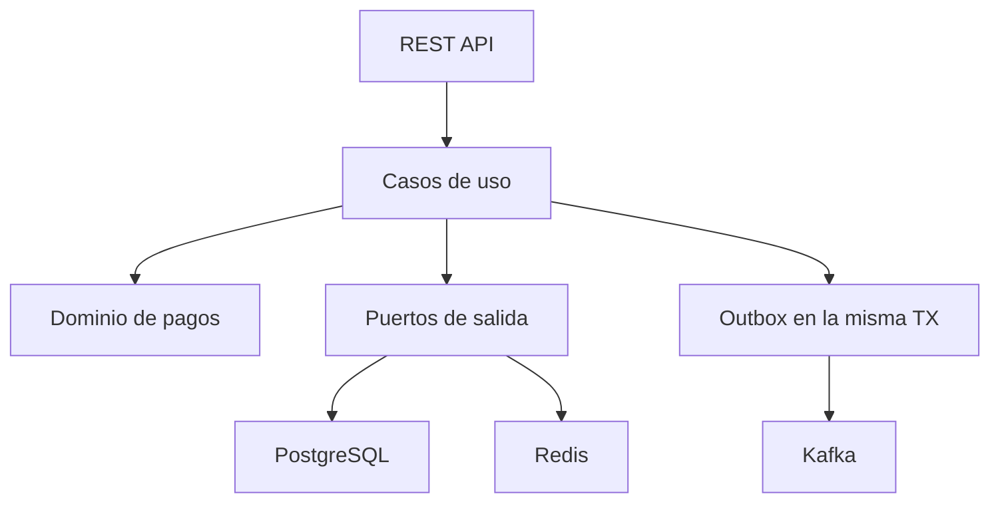

# KunturPay Event Platform

Kuntur significa **cóndor** en quechua: una identidad peruana para un backend de
pagos orientado a eventos, construido con Java 21 y Spring Boot para
demostrar competencias de nivel senior en un contexto financiero. No es un CRUD:
modela autorización, captura, rechazo, reembolso parcial/total, idempotencia,
concurrencia optimista y publicación confiable de eventos.

> Proyecto de portafolio de Víctor Yordi Díaz González. No procesa tarjetas reales
> ni está afiliado a Culqi o BCP.

## Qué demuestra

| Requisito del rol | Implementación |
|---|---|
| Java backend avanzado | Java 21, dominio rico, records, API REST versionada |
| Spring Boot / Quarkus | Spring Boot 3.5 con puertos que facilitan migrar adaptadores |
| Arquitectura orientada a eventos | Kafka + eventos versionados + Transactional Outbox |
| PostgreSQL | JPA, Flyway, índices, constraints y optimistic locking |
| Redis | Idempotencia distribuida con TTL y detección de replay/conflicto |
| APIs REST / Postman | OpenAPI, Swagger UI y colección Postman |
| Clean Code / SOLID / Hexagonal | Dominio sin dependencias de frameworks + pruebas ArchUnit |
| JUnit / calidad | JUnit 5, Mockito, AssertJ, Testcontainers y JaCoCo |
| CI/CD / GitHub Actions | Build, unit tests, integration tests, imagen Docker y Sonar opcional |
| Kubernetes / EKS | Deployment, probes, requests/limits, HPA y configuración externa |
| AWS | Frontera preparada; roadmap para EKS, EventBridge, Lambda, SQS/SNS y RDS |
| Observabilidad | Actuator, Prometheus, correlation ID y logs seguros |
| Seguridad | API key en local, sesión stateless y rechazo de datos PAN crudos |

### Estado verificable

- `22` pruebas unitarias y de arquitectura.
- `67.9 %` de cobertura de líneas; el build exige un mínimo de `65 %`.
- Imagen Docker multi-stage ejecutada con usuario sin privilegios.
- Contratos OpenAPI y Postman, Compose local y manifiestos Kubernetes/EKS.
- Métricas de autorización, captura, reembolso e idempotencia en Prometheus.

## Arquitectura



La dependencia siempre apunta hacia el centro:

```text
adapter/in -> application -> domain
adapter/out -> application ports
domain -> solo Java
```

PostgreSQL usa `BIGINT` como clave interna y la API expone solo `public_id` UUID.

Consulta [docs/ARCHITECTURE.md](docs/ARCHITECTURE.md) para decisiones,
consistencia, fallos y evolución AWS.

## Flujo principal

1. El cliente envía `POST /api/v1/payments` con `Idempotency-Key`.
2. Redis reserva la llave mediante una operación atómica.
3. El dominio crea el pago y el gateway simulado autoriza o rechaza.
4. Pago y evento Outbox se guardan en una misma transacción PostgreSQL.
5. Al confirmar la transacción, la llave pasa a `COMPLETED`.
6. El publicador Outbox envía el evento a Kafka con la ID del pago como key.
7. Si Kafka falla, el evento queda pendiente y se reintenta con backoff.

## Requisitos

- JDK 21
- Docker Desktop o Docker Engine con Compose
- No necesitas instalar Maven: `mvnw`/`mvnw.cmd` descarga Maven 3.9.16.

Verifica:

```bash
java -version
docker --version
docker compose version
```

## Ejecución rápida

### Opción A: todo con Docker

```bash
cp .env.example .env
docker compose up --build
```

En Windows PowerShell:

```powershell
Copy-Item .env.example .env
docker compose up --build
```

### Opción B: infraestructura en Docker y app desde el IDE

```bash
docker compose up -d postgres redis kafka
./mvnw spring-boot:run
```

En Windows:

```powershell
docker compose up -d postgres redis kafka
.\mvnw.cmd spring-boot:run
```

Servicios:

- API: <http://localhost:8080>
- Swagger: <http://localhost:8080/swagger-ui.html>
- Health: <http://localhost:8080/actuator/health>
- Prometheus: <http://localhost:8080/actuator/prometheus>

Credencial local:

```text
X-API-Key: local-secret-key-change-me
```

## Probar la API

Crear pago autorizado:

```bash
curl -i -X POST http://localhost:8080/api/v1/payments \
  -H "Content-Type: application/json" \
  -H "X-API-Key: local-secret-key-change-me" \
  -H "Idempotency-Key: payment-order-1001" \
  -d '{
    "merchantId": "8a736e75-4e2b-43d0-a132-fb88dace28cf",
    "orderId": "ORDER-1001",
    "amount": 150.00,
    "currency": "PEN",
    "paymentToken": "tok_test_visa_4242",
    "description": "Compra de prueba"
  }'
```

Para simular rechazo usa un token que termine en `0000`:

```text
tok_test_visa_0000
```

Operaciones:

| Método | Ruta | Resultado |
|---|---|---|
| `POST` | `/api/v1/payments` | Autoriza o rechaza un pago |
| `GET` | `/api/v1/payments/{uuid}` | Consulta por UUID público |
| `GET` | `/api/v1/payments?merchantId=...` | Lista paginada por comercio |
| `POST` | `/api/v1/payments/{uuid}/capture` | Captura un pago autorizado |
| `POST` | `/api/v1/payments/{uuid}/refunds` | Reembolsa parcial o totalmente |

Importa [postman/KunturPay.postman_collection.json](postman/KunturPay.postman_collection.json)
para ejecutar el flujo completo.

## Idempotencia

- Misma llave + mismo payload: devuelve el pago creado, sin cobrar otra vez.
- Misma llave + payload distinto: `409 IDEMPOTENCY_CONFLICT`.
- Misma llave mientras está en proceso: `409`, el cliente debe reintentar.
- La reserva en proceso expira a los 2 minutos.
- El resultado completado queda 24 horas.
- Además existe un `UNIQUE (merchant_id, order_id)` como segunda defensa.

El `paymentToken` representa tokenización PCI. La API rechaza números de tarjeta
crudos y nunca devuelve el token completo.

## Pruebas y calidad

```bash
# Unitarias + arquitectura
./mvnw clean verify

# Integración real con PostgreSQL mediante Testcontainers
./mvnw -Pintegration verify
```

Cobertura: `target/site/jacoco/index.html`.

Sonar local:

```bash
./mvnw sonar:sonar \
  -Dsonar.host.url=http://localhost:9000 \
  -Dsonar.token=TU_TOKEN
```

## Eventos

Topic por defecto: `kunturpay.payments.v1`.

- `payment.authorized.v1`
- `payment.declined.v1`
- `payment.captured.v1`
- `payment.refunded.v1`

Cada evento incluye `eventId`, `eventType`, `eventVersion`, `aggregateId`,
`occurredAt` y `payload`. Un consumidor debe deduplicar por `eventId`.

## Estructura

```text
src/main/java/pe/victoryordi/paycore
├── domain                 # Reglas y eventos, sin framework
├── application
│   ├── port/in            # Casos de uso
│   ├── port/out           # Contratos de infraestructura
│   └── service            # Orquestación transaccional
├── adapter
│   ├── in/web             # REST, DTOs y errores
│   └── out                # JPA, Redis, Kafka/outbox y gateway
└── config                 # Seguridad, OpenAPI, clock y correlación
```

## Despliegue

Los manifiestos de `deploy/k8s` incluyen Deployment, Service, ConfigMap, Secret
de ejemplo y HPA. Antes de producción:

1. Publicar la imagen en ECR.
2. Sustituir el Secret por AWS Secrets Manager + External Secrets.
3. Configurar RDS PostgreSQL, ElastiCache Redis y MSK/Confluent.
4. Asociar un IAM Role al ServiceAccount (IRSA).
5. Aplicar NetworkPolicies, TLS, WAF y rotación de secretos.

El plan detallado para la siguiente fase está en
[deploy/aws/README.md](deploy/aws/README.md).

## Decisiones que puedes explicar en entrevista

- Por qué Outbox evita el dual write `DB + Kafka`.
- Por qué Redis acelera idempotencia, pero PostgreSQL mantiene una segunda defensa.
- Cómo optimistic locking evita capturas/reembolsos concurrentes perdidos.
- Por qué el dominio no conoce JPA, Kafka, Redis ni AWS.
- Cómo evolucionar Kafka hacia EventBridge sin cambiar casos de uso.
- Cómo diseñar reintentos seguros, DLQ, trazabilidad y alertas.

Consulta [docs/INTERVIEW_GUIDE.md](docs/INTERVIEW_GUIDE.md) para una explicación
de 5 minutos y preguntas técnicas.

El workflow Gitflow, Conventional Commits y checklist de Code Review están en
[CONTRIBUTING.md](CONTRIBUTING.md).
