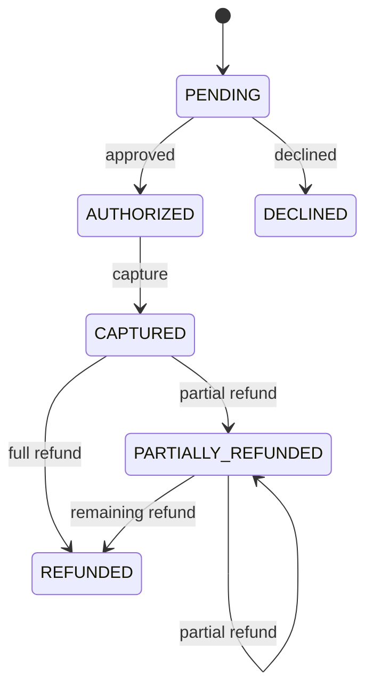
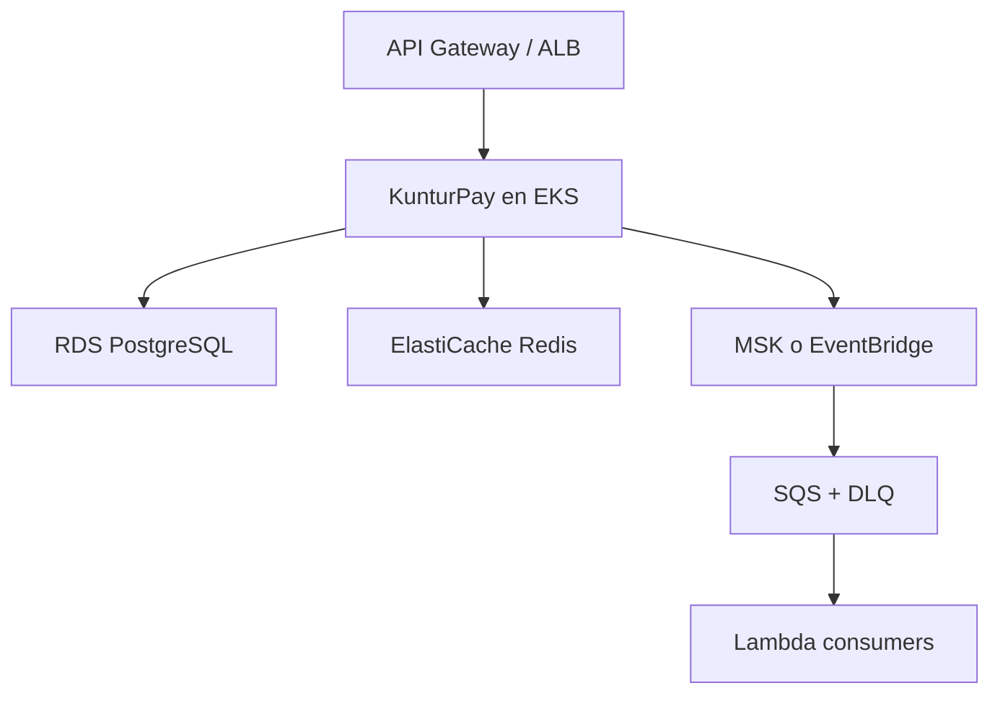

# Arquitectura y decisiones técnicas

## Contexto

KunturPay recibe solicitudes de pago de comercios. La prioridad es evitar cargos
duplicados, preservar el orden de las transiciones y comunicar cambios de estado
sin perder eventos.

## Límites

- El servicio acepta tokens, nunca PAN/CVV.
- El gateway de este repositorio es simulado.
- Autorización, captura y reembolso son síncronos para una demo clara.
- La comunicación hacia otros bounded contexts es asíncrona.

## Componentes

| Componente | Responsabilidad |
|---|---|
| REST adapter | Validación de contrato, códigos HTTP y DTOs |
| Application service | Orquestación, transacciones y puertos |
| Payment aggregate | Invariantes y máquina de estados |
| JPA adapter | Persistencia y optimistic locking |
| Redis adapter | Reserva y replay idempotente |
| Outbox adapter | Persistir evento en la transacción del pago |
| Outbox publisher | Publicar en Kafka con retry/backoff |
| Gateway adapter | Simular adquirente y permitir reemplazo |

## Máquina de estados



Una transición inválida devuelve `422 INVALID_PAYMENT_STATE`.

## Consistencia

### Pago + evento

Pago y Outbox se insertan bajo la misma transacción local. Por eso solo pueden
ocurrir dos resultados:

- ambos quedan confirmados;
- ambos se revierten.

Kafka no participa en la transacción. El publisher toma pendientes, publica y
marca `published_at`. La entrega es *at least once*, así que el consumidor debe
deduplicar `eventId`.

### Idempotencia

Redis usa `SET NX` para adquirir la llave. Cada reserva recibe un lease aleatorio
y los cambios `complete/delete` usan scripts Lua compare-and-set, evitando que
una solicitud vencida borre o sobrescriba la reserva de otra. Los valores representan:

```text
PROCESSING|fingerprint|leaseToken
COMPLETED|fingerprint|paymentId
```

El fingerprint SHA-256 se calcula con los campos relevantes. Si la transacción
confirma, la llave se completa; si revierte, se libera. La restricción única de
comercio + orden protege ante pérdida de Redis o llaves diferentes.

En una versión regulada, conviene persistir también la solicitud idempotente en
PostgreSQL y completar Redis como caché. Esto permite replay exacto aun después
de una caída total de Redis.

## Concurrencia

`@Version` evita lost updates. Dos capturas o reembolsos simultáneos leen la misma
versión, pero solo uno confirma; el otro recibe `409 CONCURRENT_UPDATE` y puede
releer el estado.

## Fallos esperados

| Fallo | Comportamiento | Siguiente mejora |
|---|---|---|
| Kafka no disponible | Evento permanece en Outbox y reintenta | DLQ + alerta por antigüedad |
| Redis no disponible | La creación falla antes de cobrar | Redis Cluster / fallback DB |
| PostgreSQL no disponible | No se autoriza solicitud | Circuit breaker y readiness |
| Timeout del adquirente | No asumir rechazo | Consulta/reconciliación por referencia |
| Respuesta perdida | Cliente repite con la misma llave | Replay idempotente |
| Dos reembolsos simultáneos | Uno falla por versión | Releer y decidir retry |

## Observabilidad

- `X-Correlation-Id` entra, se genera si falta y se devuelve.
- Logs incluyen correlation ID, event ID y aggregate ID.
- Actuator publica health/readiness/liveness.
- Prometheus expone métricas JVM, HTTP, DB y Kafka.

Métricas de negocio implementadas:

- `payments_authorization_completed_total{status,currency}`
- `payments_authorization_duration_seconds{status}`
- `payments_capture_completed_total{currency}`
- `payments_refund_completed_total{resulting_status,currency}`
- `payments_refund_amount{currency}`
- `payments_idempotency_replay_total`
- `payments_idempotency_conflict_total`

Los nombres exportados por Micrometer siguen la convención del backend de
Prometheus. El puerto `PaymentTelemetryPort` evita acoplar los casos de uso a
Micrometer o a Dynatrace.

SLO inicial:

- 99.9 % de disponibilidad mensual.
- p95 de autorización menor a 500 ms, excluyendo adquirente externo.
- 99 % de eventos publicados antes de 30 s.
- cero cargos duplicados confirmados.

## Evolución AWS



Los puertos `PaymentGatewayPort`, `IdempotencyPort` y `OutboxPort` son la frontera
de sustitución. Un adaptador EventBridge implementaría publicación sin cambiar
el dominio.

## Riesgos antes de producción

- Aplicar PCI DSS, tokenización certificada y secretos en Secrets Manager.
- Autenticación OAuth2/JWT con scopes y mTLS entre servicios.
- Separar autorización remota de la transacción DB.
- Implementar reconciliación y estados `UNKNOWN`/`REQUIRES_ACTION`.
- Cifrar datos sensibles y definir retención/borrado.
- Pruebas de carga, chaos, pentest, DR y runbooks.
- Multi-AZ, backups PITR, RPO/RTO y procedimientos de replay.
